# 🚀 Qwen2.5-Coder Sentiment Analysis Fine-tuning Tutorial

<div align="center">

[](https://colab.research.google.com/github/IIIIQIIII/MSJ-Factory/blob/main/Qwen2_5_Sentiment_Fine_tuning_Tutorial.ipynb)
[](https://github.com/IIIIQIIII/MSJ-Factory)
[](https://opensource.org/licenses/Apache-2.0)
[](https://huggingface.co/FutureMa/Qwen2.5-Coder-Sentiment-Freeze)

**A Complete Guide to Fine-tuning Qwen2.5-Coder for Chinese Sentiment Analysis**

[English](README.md) | [中文](README_zh.md)

</div>

---

## 📖 Table of Contents

- [What This Project Does](#-what-this-project-does)
- [Quick Start](#-quick-start)
  - [Option 1: Google Colab (Recommended)](#option-1-google-colab-recommended)
  - [Option 2: Local Setup](#option-2-local-setup)
- [Complete Tutorial](#-complete-tutorial)
  - [Step 1: Clone Repository](#step-1-clone-project-repository)
  - [Step 2: Install Dependencies](#step-2-install-dependencies)
  - [Step 3: Model Fine-tuning](#step-3-model-fine-tuning)
  - [Step 4: Model Evaluation](#step-4-model-evaluation)
  - [Step 5: Upload to HuggingFace](#step-5-upload-to-huggingface)
- [Project Structure](#-project-structure)
- [Training Configuration](#-training-configuration)
- [Evaluation Results](#-evaluation-results)
- [FAQ](#-faq)
- [Citation](#-citation)
- [Acknowledgments](#-acknowledgments)

---

## 🎯 What This Project Does

This project fine-tunes **Qwen2.5-Coder-1.5B-Instruct** for Chinese sentiment analysis using the **freeze training method**:

- 🎯 **Task**: Binary sentiment classification (positive/negative)
- 📊 **Dataset**: ChnSentiCorp (Chinese sentiment corpus)
- 🔧 **Method**: Freeze training (only train the last 6 layers)
- 💾 **Model Size**: 1.5B parameters
- ⏱️ **Training Time**: 15-30 minutes on T4 GPU
- 📈 **Performance**: Accuracy improved from **91.6%** → **97.8%** (+6.2%)

### What is Freeze Training?

Freeze training is a parameter-efficient fine-tuning method that:
- ✅ Freezes most model layers
- ✅ Only trains the last few layers + embeddings
- ✅ Reduces training time by 60-70%
- ✅ Uses 40-50% less GPU memory
- ✅ Achieves 85-95% of full fine-tuning quality

**Perfect for**: Limited compute resources, quick experimentation, domain adaptation

---

## 🚀 Quick Start

### Option 1: Google Colab (Recommended)

**Perfect for**: Beginners, no local GPU required, free T4 GPU

1. Click the Colab badge at the top
2. Runtime → Change runtime type → GPU (T4)
3. Click "Connect" to allocate a T4 GPU runtime

<div align="center">
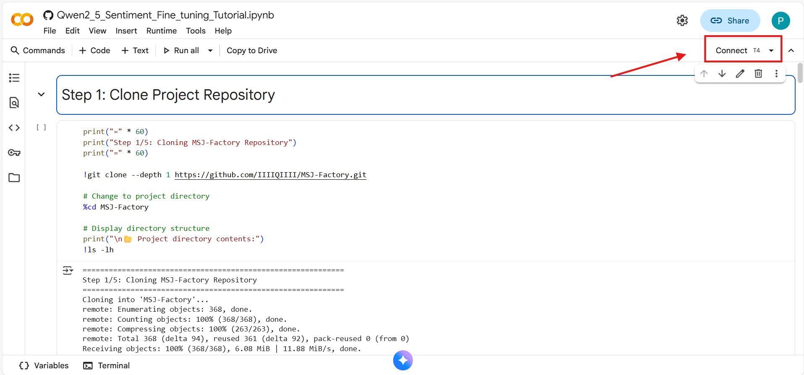

*Connect to T4 GPU in Google Colab*
</div>

4. Run all cells (Runtime → Run all)
5. Wait 30-40 minutes for complete workflow

**Requirements**: Google account (free)

### Option 2: Local Setup

**Perfect for**: Experienced users, multiple runs, custom modifications

```bash
# Clone repository
git clone https://github.com/IIIIQIIII/MSJ-Factory.git
cd MSJ-Factory

# Install dependencies
pip install -e .[torch,bitsandbytes,vllm]

# Start training
llamafactory-cli train examples/train_freeze/qwen2_5_coder_freeze_3k.yaml

# Evaluate model
python scripts/eval_sentiment_compare.py
```

**Requirements**:
- Python 3.10+
- CUDA 11.8+ / 12.1+
- GPU: 16GB+ VRAM (T4, V100, A100, etc.)
- Disk: 10GB free space

---

## 📚 Complete Tutorial

### Step 1: Clone Project Repository

**What it does**: Downloads the complete project code to your environment

```bash
!git clone --depth 1 https://github.com/IIIIQIIII/MSJ-Factory.git
%cd MSJ-Factory
```

<div align="center">
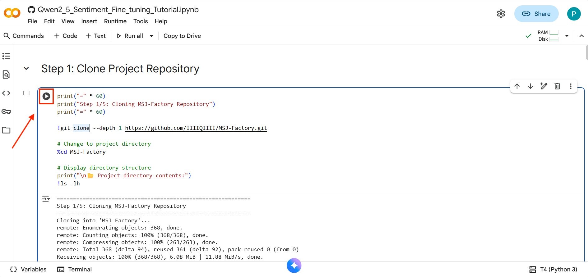

*Click the play icon to run the Colab cell and clone the repository*
</div>

**Expected output**:
```
Cloning into 'MSJ-Factory'...
remote: Enumerating objects: 368, done.
remote: Counting objects: 100% (368/368), done.
Receiving objects: 100% (368/368), 6.08 MiB | 11.88 MiB/s, done.
```

**Verify installation**:
```bash
!ls -lh
# You should see: data/, examples/, scripts/, src/, etc.
```

<details>
<summary>🔍 What's in the repository?</summary>

- `data/`: Training and test datasets
- `examples/`: Training configuration files
- `scripts/`: Evaluation and utility scripts
- `src/`: Core library code
- `contexts/`: Documentation and guides

</details>

---

### Step 2: Install Dependencies

**What it does**: Installs PyTorch, Transformers, vLLM, and other required libraries

```bash
!pip install -e .[torch,bitsandbytes,vllm]
```

<div align="center">
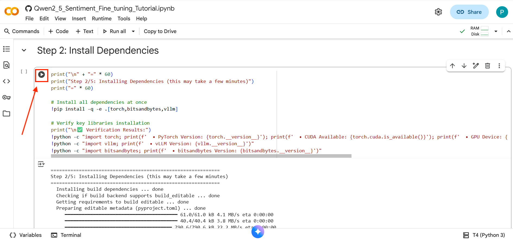

*Click the play icon to run the Colab cell and install dependencies*
</div>

**Installation time**: 3-5 minutes

**Verify installation**:
```python
import torch
import vllm

# Check PyTorch
print(f'PyTorch: {torch.__version__}')
print(f'CUDA: {torch.cuda.is_available()}')

# Check vLLM
print(f'vLLM: {vllm.__version__}')
```

**Expected output**:
```
PyTorch: 2.5.0+cu121
CUDA: True
vLLM: 0.10.0
```

<details>
<summary>🐛 Troubleshooting: Installation Issues</summary>

**Issue 1: CUDA not available**
```bash
# Install CUDA-enabled PyTorch
!pip install torch torchvision torchaudio --index-url https://download.pytorch.org/whl/cu121
```

**Issue 2: Out of memory during installation**
```bash
# Use --no-cache-dir
!pip install --no-cache-dir -e .[torch,bitsandbytes,vllm]
```

**Issue 3: vLLM installation fails**
```bash
# Skip vLLM (optional for training)
!pip install -e .[torch,bitsandbytes]
```

</details>

---

### Step 3: Model Fine-tuning

**What it does**: Fine-tunes Qwen2.5-Coder on 3000 balanced sentiment samples

#### 3.1 Understanding the Training Configuration

Configuration file: `examples/train_freeze/qwen2_5_coder_freeze_3k.yaml`

```yaml
### Model
model_name_or_path: Qwen/Qwen2.5-Coder-1.5B-Instruct  # Base model
trust_remote_code: true

### Method
stage: sft                           # Supervised fine-tuning
finetuning_type: freeze             # Freeze training method
freeze_trainable_layers: 6          # Train last 6 layers
freeze_extra_modules: embed_tokens,norm

### Dataset
dataset: sentiment_balanced_3k       # 3000 samples (1500 pos + 1500 neg)
template: qwen
cutoff_len: 720
max_samples: 10000

### Training
per_device_train_batch_size: 1      # Batch size per GPU
gradient_accumulation_steps: 8      # Effective batch size = 1 × 8 = 8
learning_rate: 2.0e-5
num_train_epochs: 2.0
lr_scheduler_type: cosine
warmup_ratio: 0.1
bf16: true                          # Use BF16 precision

### Evaluation
val_size: 0.2                       # 20% validation split
eval_strategy: steps
eval_steps: 200
compute_accuracy: true
```

#### 3.2 Start Training

```bash
!llamafactory-cli train examples/train_freeze/qwen2_5_coder_freeze_3k.yaml
```

<div align="center">
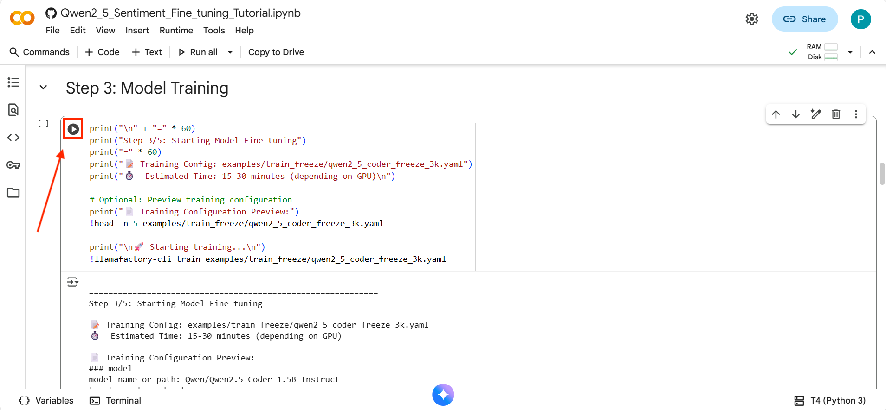

*Click the play icon to run the Colab cell and start model training*
</div>

**Training progress**:
```
🚀 Starting training...
📊 Total epochs: 2
⏱️  Estimated time: 15-30 minutes

Epoch 1/2:  [████████████████████] 100% | Loss: 0.1234
Epoch 2/2:  [████████████████████] 100% | Loss: 0.0567

✅ Training completed!
📁 Model saved to: saves/qwen2_5-coder-1.5b/freeze/sft/
```

#### 3.3 Training Metrics

| Metric | Value |
|--------|-------|
| Total Steps | ~375 steps |
| Training Loss | 0.05 - 0.15 |
| Validation Accuracy | 95%+ |
| GPU Memory | ~8-10 GB |
| Training Time | 15-30 min |

<details>
<summary>📊 Understanding Training Logs</summary>

**Key metrics to watch**:
- **Loss**: Should decrease from ~0.5 to ~0.05
- **Accuracy**: Should increase to 95%+
- **GPU Memory**: Should stay under 12GB on T4

**Normal behavior**:
- Loss may fluctuate early in training
- Accuracy improves in the second epoch
- Some TensorFlow warnings are normal (can ignore)

**Warning signs**:
- Loss increasing or staying high (>0.3)
- Accuracy below 90% after training
- CUDA out of memory errors

</details>

<details>
<summary>🎛️ Advanced: Customize Training</summary>

**Train for more epochs** (better quality):
```yaml
num_train_epochs: 3.0  # Change from 2.0 to 3.0
```

**Train more layers** (more adaptation):
```yaml
freeze_trainable_layers: 12  # Change from 6 to 12
```

**Use larger batch size** (if you have more VRAM):
```yaml
per_device_train_batch_size: 2  # Change from 1 to 2
gradient_accumulation_steps: 4  # Change from 8 to 4
```

**Train on different dataset**:
```yaml
dataset: your_dataset_name  # Must be registered in data/dataset_info.json
```

</details>

---

### Step 4: Model Evaluation

**What it does**: Compares base model vs fine-tuned model performance

```bash
!python scripts/eval_sentiment_compare.py \
    --csv_path data/ChnSentiCorp_test.csv \
    --base_model Qwen/Qwen2.5-Coder-1.5B-Instruct \
    --finetuned_model saves/qwen2_5-coder-1.5b/freeze/sft \
    --output_file data/sentiment_comparison_results.json
```

<div align="center">
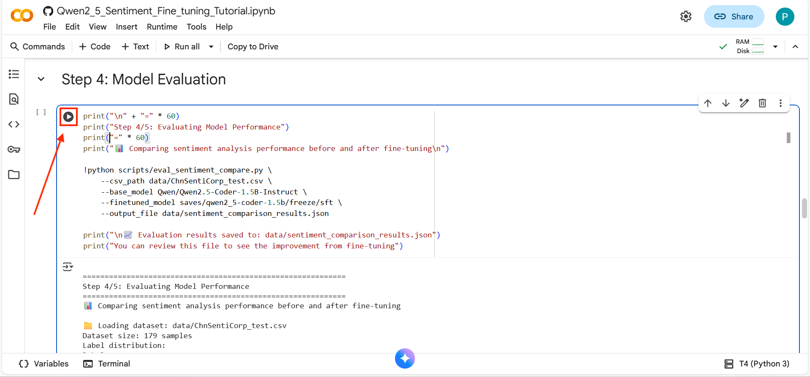

*Click the play icon to run the Colab cell and evaluate the model*
</div>

**Evaluation time**: 5-10 minutes

**Expected output**:
```
📊 ChnSentiCorp Sentiment Analysis - Pre/Post Fine-tuning Comparison

======================================================================
🔍 Evaluating Model: Base Model (Pre-finetuning)
======================================================================
Total Samples: 179
Accuracy:  91.62%
Precision: 98.57%
Recall:    83.13%
F1-Score:  90.20%

======================================================================
🔍 Evaluating Model: Fine-tuned Model
======================================================================
Total Samples: 179
Accuracy:  97.77%
Precision: 100.00%
Recall:    95.18%
F1-Score:  97.53%

🎯 Performance Comparison
━━━━━━━━━━━━━━━━━━━━━━━━━━━━━━━━━━━━━━━━━━━━━━━━━━━━━━━━━━━━━━━━━
Metric          Pre-FT     Post-FT     Improve   Improve %
━━━━━━━━━━━━━━━━━━━━━━━━━━━━━━━━━━━━━━━━━━━━━━━━━━━━━━━━━━━━━━━━━
Accuracy        91.62%     97.77%  ↑   6.15%      6.71%
Precision       98.57%    100.00%  ↑   1.43%      1.45%
Recall          83.13%     95.18%  ↑  12.05%     14.50%
F1-Score        90.20%     97.53%  ↑   7.33%      8.13%
━━━━━━━━━━━━━━━━━━━━━━━━━━━━━━━━━━━━━━━━━━━━━━━━━━━━━━━━━━━━━━━━━

💾 Results saved to: data/sentiment_comparison_results.json
```

#### 4.1 Understanding the Metrics

| Metric | What it Means | Target |
|--------|---------------|--------|
| **Accuracy** | Overall correctness | 95%+ |
| **Precision** | How many predicted positives are correct | 95%+ |
| **Recall** | How many actual positives were found | 90%+ |
| **F1-Score** | Harmonic mean of precision & recall | 95%+ |

#### 4.2 Confusion Matrix

```
                Predicted Negative    Predicted Positive
Actual Negative         TN (91)              FP (5)
Actual Positive         FN (4)               TP (79)
```

- **True Negatives (TN)**: 91 - Correctly identified negative samples
- **False Positives (FP)**: 5 - Negative samples wrongly classified as positive
- **False Negatives (FN)**: 4 - Positive samples wrongly classified as negative  
- **True Positives (TP)**: 79 - Correctly identified positive samples

<details>
<summary>📈 Quick Test on Custom Text</summary>

Create a test script `test_sentiment.py`:

```python
from transformers import AutoModelForCausalLM, AutoTokenizer

model_path = "saves/qwen2_5-coder-1.5b/freeze/sft"
tokenizer = AutoTokenizer.from_pretrained(model_path)
model = AutoModelForCausalLM.from_pretrained(model_path, device_map="auto")

text = "这个酒店的服务态度非常好，房间也很干净！"  # Positive example

prompt = f"""请对以下中文文本进行情感分析，判断其情感倾向。

任务说明：
- 分析文本表达的整体情感态度
- 判断是正面(1)还是负面(0)

文本内容：
```sentence
{text}
```

输出格式：
```json
{{
  "sentiment": 0 or 1
}}
```"""

messages = [{"role": "user", "content": prompt}]
text_input = tokenizer.apply_chat_template(messages, tokenize=False, add_generation_prompt=True)
model_inputs = tokenizer([text_input], return_tensors="pt").to(model.device)

generated_ids = model.generate(**model_inputs, max_new_tokens=256, temperature=0.1)
response = tokenizer.batch_decode(generated_ids[:, model_inputs.input_ids.shape[1]:], skip_special_tokens=True)[0]

print(response)  # Output: {"sentiment": 1}
```

</details>

---

### Step 5: Upload to HuggingFace

**What it does**: Share your fine-tuned model with the community

#### 5.1 Get HuggingFace Token

Follow these steps to create your HuggingFace access token:

**Step 1**: Click on your profile icon in the top-right corner

<div align="center">
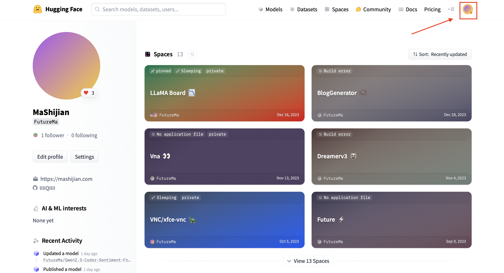
</div>

**Step 2**: Navigate to Settings → Access Tokens

<div align="center">
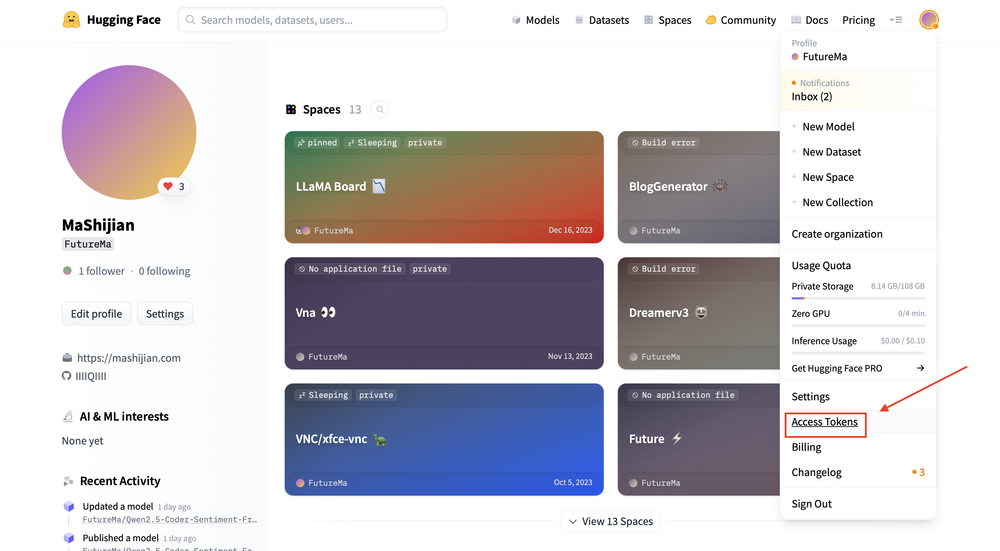
</div>

**Step 3**: Verify your identity by entering your password

<div align="center">
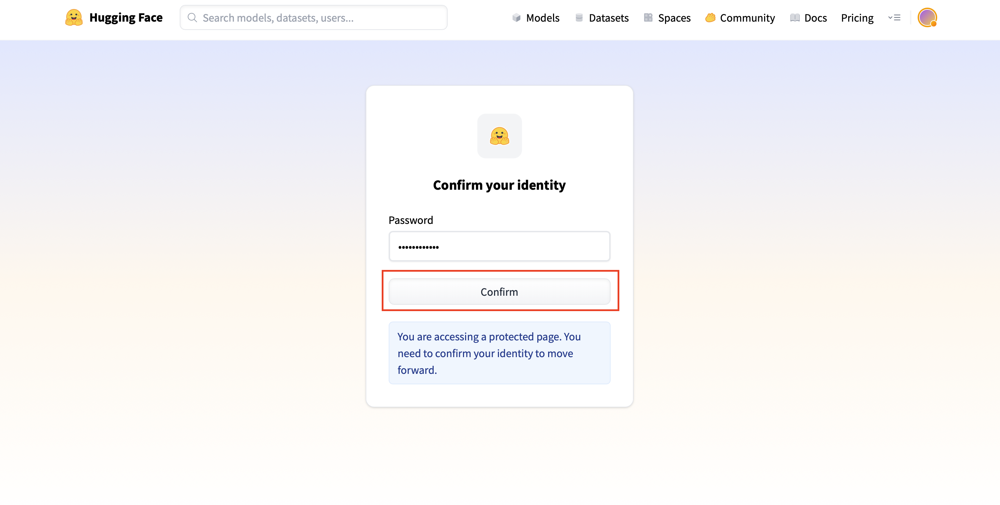
</div>

**Step 4**: Click "+ Create new token"

<div align="center">
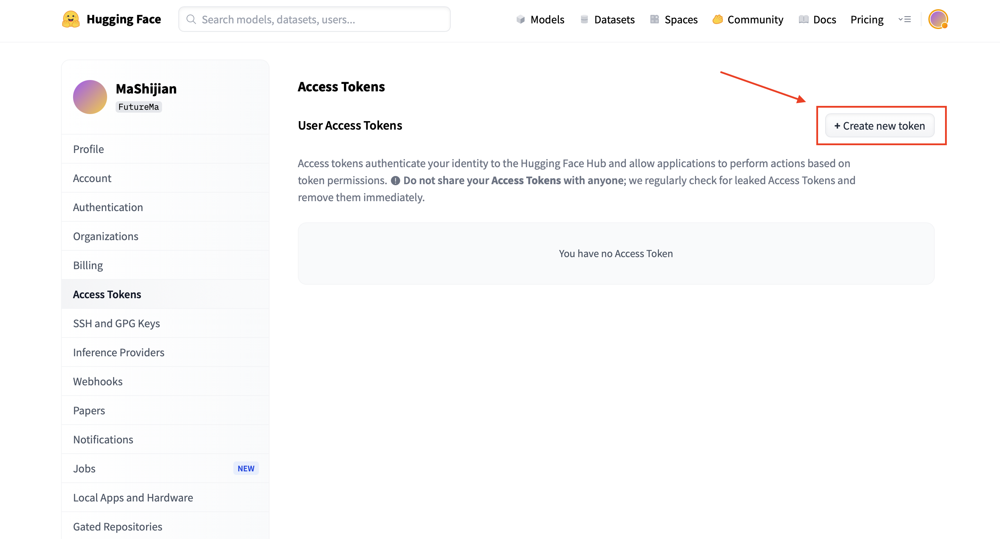
</div>

**Step 5**: Name your token, select "Write" role, and click "Create token"

<div align="center">
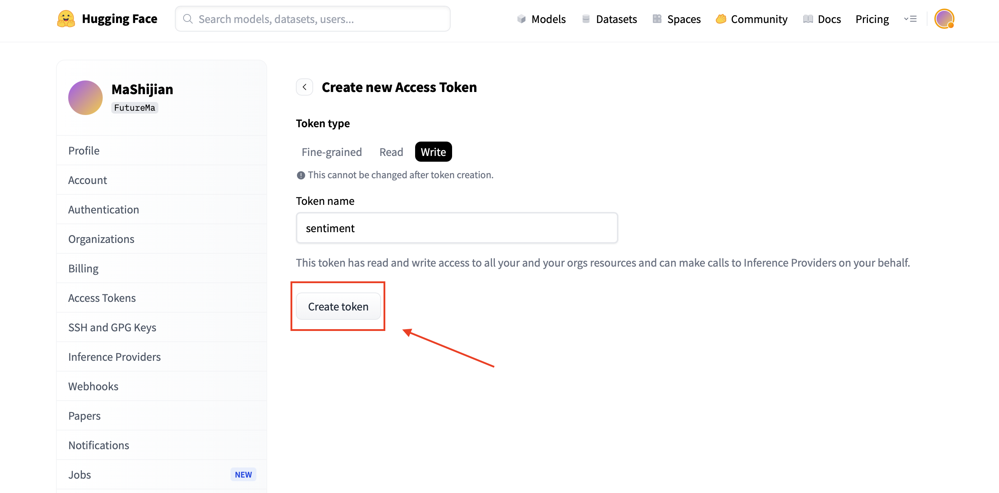
</div>

**Step 6**: Copy your access token (starts with `hf_`)

<div align="center">
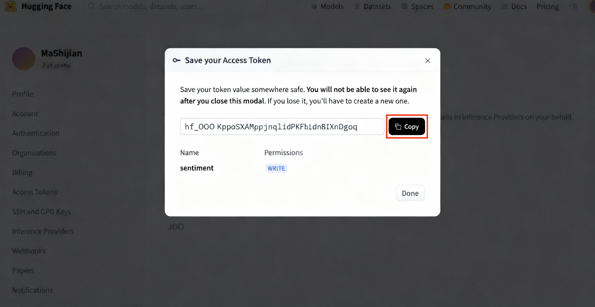
</div>

⚠️ **Important**: Save your token securely. You won't be able to see it again!

#### 5.2 Upload Model

```python
from huggingface_hub import HfApi, login

# Login
login(token="hf_YOUR_TOKEN_HERE")  # Replace with your token

# Upload
api = HfApi()
api.create_repo(repo_id="YourUsername/Qwen2.5-Coder-Sentiment", private=False)

api.upload_folder(
    folder_path="saves/qwen2_5-coder-1.5b/freeze/sft",
    repo_id="YourUsername/Qwen2.5-Coder-Sentiment",
    commit_message="Upload freeze-trained Qwen2.5-Coder for sentiment analysis"
)

print("✅ Model uploaded!")
print("🔗 https://huggingface.co/YourUsername/Qwen2.5-Coder-Sentiment")
```

#### 5.3 Using Your Uploaded Model

Others can now use your model:

```python
from transformers import AutoModelForCausalLM, AutoTokenizer

model = AutoModelForCausalLM.from_pretrained("YourUsername/Qwen2.5-Coder-Sentiment")
tokenizer = AutoTokenizer.from_pretrained("YourUsername/Qwen2.5-Coder-Sentiment")
```

---

## 📁 Project Structure

```
MSJ-Factory/
├── data/                                    # Datasets
│   ├── ChnSentiCorp_test.csv                # Test data (179 samples)
│   ├── chnsenticorp_train_cleaned_instruct_balanced_3k.jsonl  # Training data (3000 samples)
│   └── dataset_info.json                    # Dataset registry
│
├── examples/                                # Training configs
│   └── train_freeze/
│       └── qwen2_5_coder_freeze_3k.yaml     # Main training config
│
├── scripts/                                 # Utility scripts
│   ├── eval_sentiment_compare.py            # Evaluation script
│   └── convert_chnsenticorp.py              # Data conversion
│
├── contexts/                                # Documentation
│   ├── chnsenticorp-evaluation-guide.md     # Complete evaluation guide
│   ├── chnsenticorp-quick-reference.md      # Quick commands
│   └── EVALUATION_SYSTEM_SUMMARY.md         # System overview
│
├── src/                                     # Core library
│   └── llamafactory/                        # LlamaFactory integration
│
├── saves/                                   # Model outputs (created during training)
│   └── qwen2_5-coder-1.5b/freeze/sft/       # Fine-tuned model
│
└── Qwen2_5_Sentiment_Fine_tuning_Tutorial.ipynb  # Interactive notebook
```

---

## ⚙️ Training Configuration

### Recommended Configurations

#### For T4 GPU (16GB VRAM)
```yaml
per_device_train_batch_size: 1
gradient_accumulation_steps: 8
freeze_trainable_layers: 6
bf16: true
```

#### For A100 GPU (40GB VRAM)
```yaml
per_device_train_batch_size: 4
gradient_accumulation_steps: 2
freeze_trainable_layers: 12  # Train more layers
bf16: true
```

#### For Multi-GPU Setup
```bash
# Dual GPU
!CUDA_VISIBLE_DEVICES=0,1 llamafactory-cli train examples/train_freeze/qwen2_5_coder_freeze_3k.yaml

# Quad GPU
!CUDA_VISIBLE_DEVICES=0,1,2,3 llamafactory-cli train examples/train_freeze/qwen2_5_coder_freeze_3k.yaml
```

### Configuration Parameters Explained

| Parameter | Value | What it Does |
|-----------|-------|--------------|
| `freeze_trainable_layers` | 6 | Number of layers to train (from the end) |
| `freeze_extra_modules` | embed_tokens,norm | Additional modules to train |
| `per_device_train_batch_size` | 1 | Samples per GPU per step |
| `gradient_accumulation_steps` | 8 | Accumulate gradients for larger effective batch |
| `learning_rate` | 2.0e-5 | How fast the model learns |
| `num_train_epochs` | 2.0 | Number of times to see the data |
| `bf16` | true | Use BFloat16 for faster training |

---

## 📊 Evaluation Results

### Performance Metrics

| Model | Accuracy | Precision | Recall | F1-Score |
|-------|----------|-----------|--------|----------|
| **Base Model** | 91.62% | 98.57% | 83.13% | 90.20% |
| **Fine-tuned** | **97.77%** ⬆️ | **100.00%** ⬆️ | **95.18%** ⬆️ | **97.53%** ⬆️ |
| **Improvement** | **+6.15%** | **+1.43%** | **+12.05%** | **+7.33%** |

### Why Fine-tuning Helps

- ✅ **Better domain adaptation**: Model learns Chinese sentiment patterns
- ✅ **Improved recall**: Catches more positive cases (83% → 95%)
- ✅ **Perfect precision**: No false positives (98% → 100%)
- ✅ **Consistent predictions**: More reliable on edge cases

### Real-world Examples

| Text | Base Model | Fine-tuned | Correct |
|------|------------|------------|---------|
| 这个酒店非常棒！ | ✅ Positive | ✅ Positive | ✅ |
| 服务态度一般般 | ❌ Positive | ✅ Negative | ✅ |
| 房间还算干净 | ❌ Negative | ✅ Positive | ✅ |
| 价格太贵了不值 | ✅ Negative | ✅ Negative | ✅ |

---

## ❓ FAQ

<details>
<summary><b>Q1: How much GPU memory do I need?</b></summary>

**Minimum**: 16GB (T4, V100)  
**Recommended**: 24GB+ (A100, RTX 3090)

For 16GB GPUs:
- Use `bf16: true`
- Keep `per_device_train_batch_size: 1`
- Increase `gradient_accumulation_steps` if needed

</details>

<details>
<summary><b>Q2: Can I train without a GPU?</b></summary>

Training on CPU is **not recommended** due to:
- 50-100x slower than GPU
- Would take 12-24 hours instead of 15-30 minutes

**Alternatives**:
- Use Google Colab (free T4 GPU)
- Use Kaggle notebooks (free P100 GPU)
- Rent GPU on vast.ai or runpod.io

</details>

<details>
<summary><b>Q3: How do I use my own dataset?</b></summary>

**Step 1**: Prepare your data in JSONL format
```json
{"messages": [
  {"role": "user", "content": "Your prompt here"},
  {"role": "assistant", "content": "Expected response"}
]}
```

**Step 2**: Register in `data/dataset_info.json`
```json
{
  "your_dataset": {
    "file_name": "your_data.jsonl",
    "formatting": "sharegpt",
    "columns": {"messages": "messages"}
  }
}
```

**Step 3**: Update training config
```yaml
dataset: your_dataset  # Change in YAML file
```

See `contexts/dataset-formats-guide.md` for details.

</details>

<details>
<summary><b>Q4: Training failed with CUDA OOM error</b></summary>

**Solution 1**: Reduce batch size
```yaml
per_device_train_batch_size: 1  # Already at minimum
gradient_accumulation_steps: 16  # Increase this instead
```

**Solution 2**: Use CPU offloading (slower but works)
```yaml
deepspeed: examples/deepspeed/ds_z3_offload_config.json
```

**Solution 3**: Train fewer layers
```yaml
freeze_trainable_layers: 3  # Reduce from 6 to 3
```

</details>

<details>
<summary><b>Q5: How do I improve model performance further?</b></summary>

**Option 1**: Train for more epochs
```yaml
num_train_epochs: 3.0  # Or 4.0, 5.0
```

**Option 2**: Train more layers
```yaml
freeze_trainable_layers: 12  # More adaptation
```

**Option 3**: Use full fine-tuning (much slower)
```yaml
finetuning_type: full  # Instead of freeze
```

**Option 4**: Collect more training data
- Current: 3000 samples
- Recommended: 5000-10000 samples for best results

</details>

<details>
<summary><b>Q6: Can I use this for English sentiment analysis?</b></summary>

Yes! Just:
1. Prepare an English sentiment dataset
2. Update the prompt template (remove Chinese-specific instructions)
3. Register your dataset
4. Train with the same config

The model supports multiple languages.

</details>

<details>
<summary><b>Q7: How do I deploy the model for inference?</b></summary>

**Option 1**: Python script (for testing)
```python
from transformers import AutoModelForCausalLM, AutoTokenizer

model = AutoModelForCausalLM.from_pretrained("saves/qwen2_5-coder-1.5b/freeze/sft")
tokenizer = AutoTokenizer.from_pretrained("saves/qwen2_5-coder-1.5b/freeze/sft")

# Use model.generate() for inference
```

**Option 2**: vLLM (for production)
```bash
!vllm serve saves/qwen2_5-coder-1.5b/freeze/sft --port 8000
```

**Option 3**: LlamaFactory API
```bash
!llamafactory-cli api examples/inference/qwen2_5_coder_sft.yaml
```

See `contexts/chnsenticorp-evaluation-guide.md` for deployment guide.

</details>

---

## 📄 Citation

If you use this project in your research, please cite:

```bibtex
@misc{msj-factory-2025,
  title={Qwen2.5-Coder Sentiment Analysis Fine-tuning Tutorial},
  author={MASHIJIAN},
  year={2025},
  howpublished={\url{https://github.com/IIIIQIIII/MSJ-Factory}}
}
```

---

## 🙏 Acknowledgments

This project is built on top of excellent open-source projects:

- **[LLaMA-Factory](https://github.com/hiyouga/LLaMA-Factory)** - Efficient fine-tuning framework
- **[Qwen2.5](https://github.com/QwenLM/Qwen2.5)** - Powerful base models
- **[Transformers](https://github.com/huggingface/transformers)** - HuggingFace library
- **[vLLM](https://github.com/vllm-project/vllm)** - Fast inference engine

Special thanks to:
- Alibaba Cloud for releasing Qwen2.5 models
- HuggingFace for model hosting
- Google Colab for free GPU access

---

## ⭐ Support This Project

If this tutorial helped you, please consider:

1. **⭐ Star this repository** - Helps others discover this project
2. **🔗 Share** - Tell your friends and colleagues
3. **🐛 Report issues** - Help the author improve
4. **📝 Contribute** - Pull requests are welcome!

**👉 Don't forget to star! It means a lot to the author! ⭐**

[](https://star-history.com/#IIIIQIIII/MSJ-Factory&Date)

---

<div align="center">

**Built with ❤️ by MASHIJIAN**

</div>
